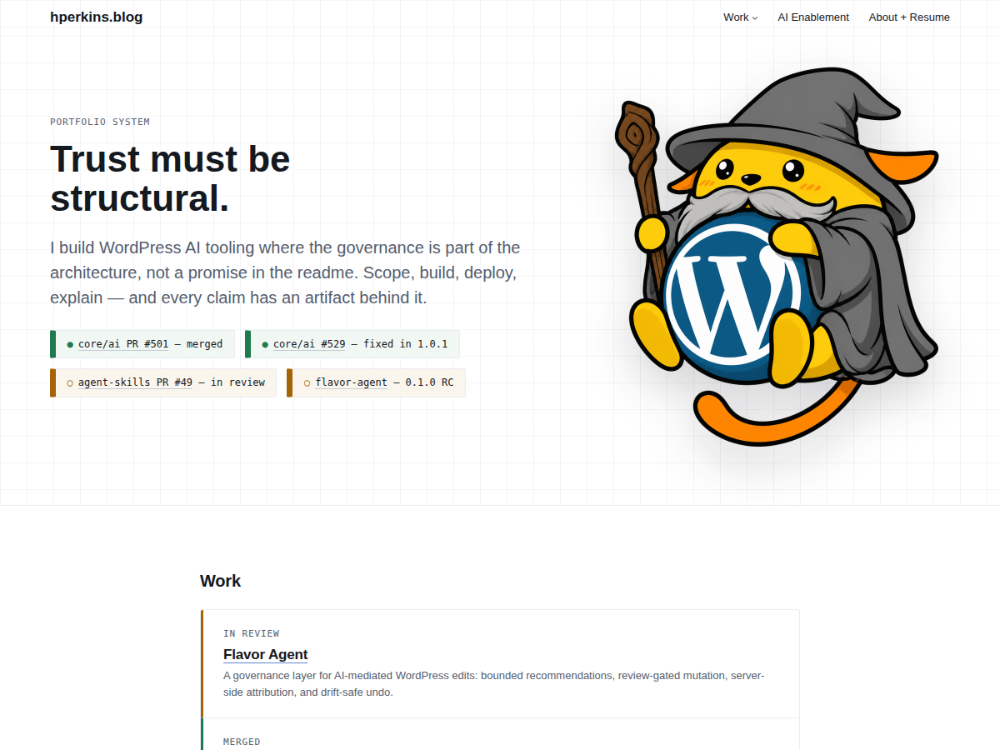

# HPerkins Tokens

[](https://github.com/henryperkins/hperkins-tokens/actions/workflows/verify.yml)

A WordPress block theme whose design decisions are enforced by the theme rather than by review — the "Imladris" design system, implemented as a child theme of [Assembler](https://wordpress.com/theme/assembler).

**Live site:** [hperkins.blog](https://hperkins.blog)
**Current release:** [v0.3.53](https://github.com/henryperkins/hperkins-tokens/releases/tag/v0.3.53)
**Deployed commit:** [`43d9ef6`](https://github.com/henryperkins/hperkins-tokens/commit/43d9ef603a6715b23af0b4fdce6076010e4b824a)
**Last verified:** 21 Jul 2026

Pushing to `main` deploys; there is no build step and no bundler. Everything is hand-authored HTML, CSS, PHP, and `theme.json`.



## Three claims you can check without taking my word for it

**1. Authors cannot introduce an off-system colour, font size, or spacing value.**
`theme.json` sets `defaultPalette`, `defaultGradients`, `defaultDuotone`, `custom`, `customGradient`, `customDuotone`, `defaultFontSizes`, `defaultSpacingSizes`, `customFontSize`, and `customSpacingSize` all to `false`. The editor therefore offers named tokens and nothing else — there is no arbitrary-value input to type a hex into. Separately, every `var()` in `style.css` is asserted to resolve against a `theme.json`-generated variable, so the hand-authored sheet cannot drift onto a token that does not exist:

```bash
node scripts/verify-style-token-usage.js
```

This governs the standard block-editor controls. Custom code and database-owned page bodies are governed by review and the snapshot contract below, not by the token system.

**2. Page bodies live in the database, and drift from the tracked copy fails a check.**
Seven page bodies are owned by the database rather than by this repo — the front page, `/about/`, `/work/`, `/ai-enablement/`, `/job-placement-digest/`, `/placement-method-and-evidence/`, and the Flavor Agent demo. Their source copies are tracked in [`content/page-snapshots/`](content/page-snapshots), and the live body is compared against them:

```bash
node scripts/verify-content-ownership.js
```

**3. The header's accessibility contract is pinned, not assumed.**
[`scripts/verify-header.js`](scripts/verify-header.js) drives Chrome against the rendered site and asserts `aria-current` on all ten destinations, focus restoration after Escape, reduced-motion behaviour, 44px mobile controls, a 13px drawer legend, and the three deliberately sub-12px Council labels at their signed-off sizes — so shrinking one further fails the run instead of passing quietly.

## A production bug this repo actually caught

Buttons had a visible keyboard focus ring locally and none in production.

Assembler's `theme.json` emits `button:focus-visible { outline: 2px solid var(--wp--preset--color--theme-4) }` into the inline global styles. `theme-4` belongs to Assembler's colour variations, which this theme hides and whose palette it replaces, so the token resolved to nothing, the `outline` shorthand was invalid at computed-value time, and `outline-style` fell back to `none`. The ring was removed outright rather than recoloured.

Both that rule and this theme's were specificity (0,1,1), so source order alone picked the winner — and the environments disagreed. Locally the child sheet printed after the global styles and won. In production, Page Optimize concatenates the file-based sheets and hoists them *above* the inline global styles, so the dead declaration won. Links were unaffected, because Assembler's selector does not match them, which is why the site otherwise looked fine.

The fix lifts the two selectors to (0,2,1) so they win on specificity in either order. The prevention matters more: `verify-header.js` now replays Assembler's declaration *last* and re-asserts the ring, so a local run measures production's stylesheet order instead of assuming its own. Details in [v0.3.52](https://github.com/henryperkins/hperkins-tokens/releases/tag/v0.3.52).

## Verify it yourself

```bash
# No site or database required.
php -l functions.php
node --test scripts/lib/content-integrity.test.js scripts/lib/navigation-content-contract.test.js scripts/lib/page-content-contract.test.js scripts/lib/page-markup-contract.test.js scripts/lib/placement-artifact-links.test.js scripts/lib/site-url.test.js scripts/lib/wp-cli.test.js scripts/lib/zip-archive.test.js
node scripts/verify-placement-artifacts.js
node scripts/verify-job-placement-digest-source.js
node scripts/verify-deployed-content-ownership.js --source-only
node scripts/verify-header.js --source-only
node scripts/verify-typography.js --source-only
node scripts/verify-content-ownership-docs.js
```

These source contracts run in CI on every push (the badge above). Main and release-tag pushes also compare the two allowlisted production bodies with their committed snapshots through the public integrity endpoint. The remaining verifiers need a browser or a WordPress database and are run against a real install:

```bash
export HPERKINS_ORIGIN=https://hperkins.blog
node scripts/verify-header.js              # drives Chrome against the rendered site
node scripts/verify-deployed-content-ownership.js # production digest + appendix vs committed mirrors

export HPERKINS_WP_PATH=/absolute/path/to/wordpress
node scripts/verify-content-ownership.js   # WP-CLI: live page bodies vs tracked snapshots
```

The full fourteen-script suite, the environment variables each one needs, and the architecture notes are in [`CLAUDE.md`](CLAUDE.md).

## Requirements

- The **`assembler`** parent theme, installed alongside this one. This is a child theme and will not activate without it.
- WordPress 6.6 or later (`theme.json` v3); tested up to WP 7.0.
- PHP 8.0 or later.

## Repository layout

| Path | What it holds |
|---|---|
| `theme.json` | The single source of truth for every design token |
| `style.css` | Hand-authored component CSS, aliased onto the generated token variables |
| `assets/imladris-pages.css` | Page-layout CSS for designs pulled from the design system |
| `inc/council-header.php` | Server-rendered Condensed Council header |
| `patterns/` | Design-system components (`imladris-*`) and content/section patterns |
| `templates/`, `parts/` | Block templates and template parts |
| `content/page-snapshots/` | Tracked mirrors of the database-owned page bodies |
| `scripts/` | Dependency-free verifiers (Node built-ins; no `npm install`) |
| `docs/design-system/` | Provenance and the design-system → theme mapping |

## Licence and changelog

GPLv2 or later. The WordPress-style theme readme, with the full changelog, is [`readme.txt`](readme.txt).
